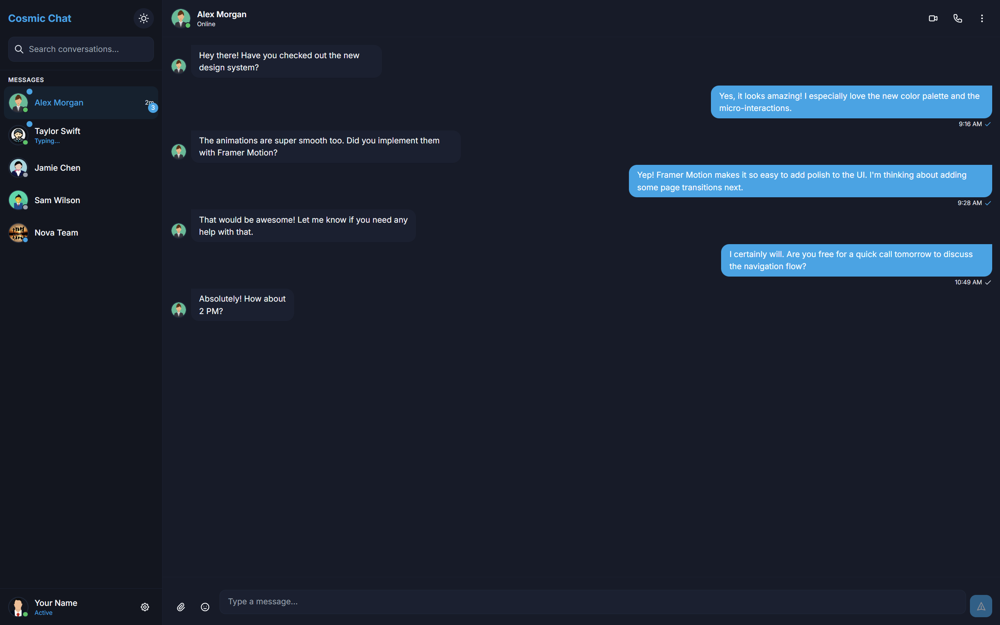

# Cosmic Chat



A modern, sleek chat application built with React, Next.js, and TailwindCSS featuring smooth animations with Framer Motion.

## ✨ Features

- **Beautiful UI/UX**: Clean and modern interface with attention to detail
- **Dark/Light Mode**: Seamless theme switching with system preference detection
- **Real-time Chat Simulation**: Simulated chat experience with typing indicators
- **Responsive Design**: Works perfectly on mobile, tablet, and desktop
- **Smooth Animations**: Polished micro-interactions using Framer Motion
- **Multiple Conversations**: Support for individual and group chats
- **Emoji Picker**: Quick emoji selection for messages
- **Message Status**: Visual indicators for sent, delivered, and read messages
- **Avatar System**: Custom avatar component with status indicators

## 🚀 Demo

Check out the live demo: [Cosmic Chat](https://ganesh2609.github.io/CosmicChat)

## 🔧 Technology Stack

- **React** - UI library
- **Next.js** - React framework for static site generation
- **TailwindCSS** - Utility-first CSS framework
- **Framer Motion** - Animation library
- **date-fns** - Date utility library
- **GitHub Pages** - Hosting platform

## 📦 Installation

1. Clone the repository:
   ```bash
   git clone https://github.com/yourusername/CosmicChat.git
   cd CosmicChat
   ```

2. Install dependencies:
   ```bash
   npm install
   ```

3. Run the development server:
   ```bash
   npm run dev
   ```

4. Open [http://localhost:3000](http://localhost:3000) in your browser to see the application

## 🔨 Building for Production

```bash
npm run build
```

This generates a static export in the `out` directory that can be served by any static hosting service.

## 📁 Project Structure

```
CosmicChat/
├── public/              # Static assets like images
├── src/
│   ├── components/      # React components
│   │   ├── chat/        # Chat UI components
│   │   ├── layout/      # Layout components
│   │   └── ui/          # Reusable UI components
│   ├── data/            # Sample data and message handling
│   ├── hooks/           # Custom React hooks
│   ├── pages/           # Next.js pages
│   ├── styles/          # Global styles
│   └── utils/           # Utility functions
├── .gitignore           # Git ignore file
├── next.config.js       # Next.js configuration
├── package.json         # Project dependencies
├── postcss.config.js    # PostCSS configuration
└── tailwind.config.js   # TailwindCSS configuration
```

## 🎨 Customization

### Themes

The application uses a custom color scheme defined in `tailwind.config.js`. You can modify the colors to match your branding:

```js
colors: {
  primary: {
    // Your primary color palette
  },
  dark: {
    // Dark mode colors
  },
  light: {
    // Light mode colors
  }
}
```

### Sample Data

Edit the sample conversations and contacts in `src/data/sampleMessages.js`. This is done as the project has no backend.